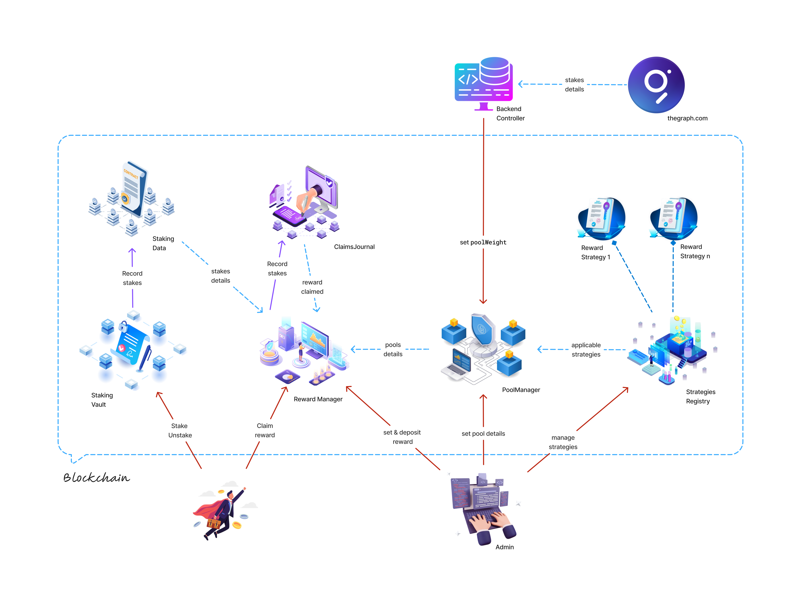

# THINK Token Staking System

A secure, flexible staking platform for tokens with time-locked commitments and comprehensive reward mechanisms.

## Getting Started

To get started, find the path that best describes you:

- **I'm a User...**
  - ➡️ **& want to learn how to stake:** [**Start with the User Guide &rarr;**](docs/user_docs.md)
- **I'm a Developer...**
  - ➡️ **& want to integrate with the system:** [**Read the Architecture Overview &rarr;**](docs/architecture_overview.md)
- **I'm a Security Auditor...**
  - ➡️ **& want to review the system's security:** [**Begin with the Audit Dossier &rarr;**](audit/README.md)

---

## System Overview

This staking platform is built with three core principles: security, data integrity, and developer-friendliness.

### Key Features

- **Security First**: Multi-layered security with role-based access control, including a dedicated `MULTISIG_ROLE` for critical recovery operations. It is protected from reentrancy attacks and can be paused in emergencies.
- **Advanced Data Management**: Uses a checkpoint system and binary search for highly-efficient historical balance queries (`O(log n)`), alongside individual stake tracking and daily statistical snapshots.
- **Developer Friendly**: A modular architecture separates logic (`StakingVault`) from data (`StakingStorage`), providing well-defined interfaces and gas-optimized operations to encourage ecosystem expansion.

## 🔗 Live Deployments & Status

### Sepolia Testnet

- **StakingVault**: [`0x5B9801ab239F07B75BffACF7e82DB05D01a1D763`](https://sepolia.etherscan.io/address/0x5B9801ab239F07B75BffACF7e82DB05D01a1D763/#code)
- **StakingStorage**: [`0x6A1ECdc267e80346F7526Fa320b7a0c147093a17`](https://sepolia.etherscan.io/address/0x6A1ECdc267e80346F7526Fa320b7a0c147093a17/#code)

### Project Status

The core staking and security framework is complete. The rewards system is planned for a future release.

## 📚 Full Documentation

For a detailed breakdown of all documentation, see the tables below.

### For Users

| Document                                       | Purpose                                              |
| ---------------------------------------------- | ---------------------------------------------------- |
| [User Guide](docs/user_docs.md)                | Basic staking concepts and step-by-step instructions |
| [Checkpoints Guide](docs/checkpoints_guide.md) | How your staking history is tracked for fair rewards |
| [Rewards Guide](docs/rewards_guide.md)         | Complete rewards system explanation (coming soon)    |

### For Developers & Auditors

| Document                                                   | Purpose                                 |
| ---------------------------------------------------------- | --------------------------------------- |
| [Architecture Overview](docs/architecture_overview.md)     | System design and architecture overview |
| [Contract Specifications](docs/contract_specifications.md) | Detailed technical specifications       |
| [Audit Dossier](audit/README.md)                           | All security-related documentation      |

## 🛠️ Technology Stack

- **Smart Contracts**: Solidity ^0.8.30
- **Testing Framework**: Foundry
- **Security Libraries**: OpenZeppelin

---

# This project is licensed under the MIT License - see the [LICENSE](LICENSE.md) file for details.

---

**Need help?** Start with the [User Guide](docs/user_docs.md) or [Architecture Overview](docs/architecture_overview.md) depending on your needs.
