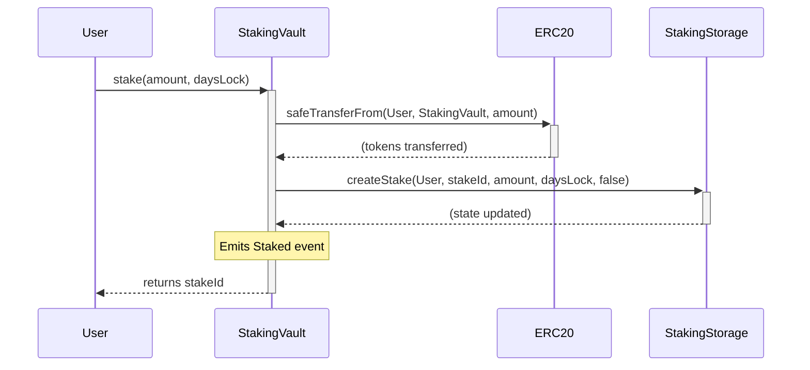
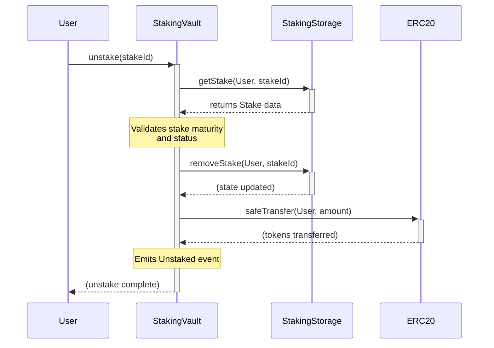

# Think Token Staking: Architecture Overview

## System Architecture

The Think Token staking system follows a modular architecture with clear separation of concerns between business logic and data storage. This design ensures security, efficiency, and maintainability.

### Core Components

#### 1. StakingVault (Business Logic Layer)

**Location**: `src/StakingVault.sol`
**Role**: Primary interface contract that handles all user interactions and business logic.

**Key Responsibilities**:

- **Token Management**: Handles IERC20 token transfers (deposits/withdrawals)
- **Stake Operations**: Creates and processes stake/unstake requests
- **Time Lock Enforcement**: Validates stake maturity before allowing unstaking
- **Access Control**: Role-based permissions (Admin, Manager, Claim Contract)
- **Security**: Reentrancy protection, pause mechanism, emergency controls

**Key Features**:

- Immutable references to token and storage contracts
- Support for both direct staking and claim contract integration
- Emergency token recovery functionality
- Comprehensive event emission for transparency

#### 2. StakingStorage (Data Persistence Layer)

**Location**: `src/StakingStorage.sol`
**Role**: Dedicated storage contract that maintains all staking data and historical records.

**Key Responsibilities**:

- **Stake Management**: Creates, tracks, and manages individual stakes
- **Historical Data**: Maintains comprehensive checkpoint system
- **Balance Tracking**: Real-time and historical balance calculations
- **Global Statistics**: Network-wide staking metrics and snapshots
- **Efficient Queries**: Optimized data retrieval with binary search algorithms

**Advanced Data Structures**:

- Checkpoint system for historical balance queries
- Binary search optimization for efficient historical lookups
- Paginated data access for large datasets
- Comprehensive daily snapshots for analytics

### Data Flow Architecture

```
User Transaction
       ↓
StakingVault (validates & processes)
       ↓
StakingStorage (persists & tracks)
       ↓
Checkpoint System (historical record)
       ↓
Event Emission (transparency)
```

### Storage Design Patterns

#### Checkpoint System

The storage contract implements a sophisticated checkpoint mechanism that automatically records balance changes:

- **Automatic Snapshots**: Every stake/unstake creates a checkpoint
- **Binary Search Optimization**: Efficient historical balance queries
- **Gas Efficiency**: Minimizes storage operations while maximizing data availability
- **Historical Integrity**: Immutable record of all balance changes

#### Stake Lifecycle Management

Each stake follows a complete lifecycle with full traceability:

1. **Creation**: Unique ID generation, initial checkpoint
2. **Active Period**: Continuous balance tracking
3. **Maturation**: Time lock validation
4. **Completion**: Unstaking with final checkpoint

### Security Architecture

#### Multi-Layer Security

- **Role-Based Access Control**: Different permission levels for different operations
- **Reentrancy Protection**: Guards against recursive call attacks
- **Pause Mechanism**: Emergency system shutdown capability
- **Time Lock Enforcement**: Immutable stake duration requirements
- **Emergency Recovery**: A feature controlled by a dedicated `MULTISIG_ROLE` to recover any ERC20 tokens accidentally sent to the contract. This prevents loss of funds while ensuring the action is controlled by a secure, multi-signature entity, separate from the general admin role.

#### Separation of Concerns

- **StakingVault**: Handles external interactions and security checks
- **StakingStorage**: Manages data integrity and historical records
- **Clear Boundaries**: Minimizes attack surface through modular design
- **Strict Role-Based Access Control**: Sensitive operations are protected by specific roles. A `MANAGER_ROLE` handles operational pausing, while a unique `MULTISIG_ROLE` is exclusively assigned to the emergency recovery function. This granular control follows the principle of least privilege.
- **Reentrancy Protection**: Key functions are guarded against reentrancy attacks using OpenZeppelin's `ReentrancyGuard`.
- **Pause Capability**: The system can be paused by a `MANAGER_ROLE` in case of an emergency, halting all primary functions like staking and unstaking.

## Integration Architecture

### Current System Integration

#### Token Integration

- **IERC20 Compatibility**: Works with any standard ERC20 token
- **SafeERC20 Usage**: Protection against non-standard token implementations
- **Immutable Token Reference**: Prevents token switching attacks

#### Claim Contract Integration

- **Dedicated Role**: `CLAIM_CONTRACT_ROLE` for external claiming systems
- **Flexible Staking**: Supports staking on behalf of users
- **Claim Marking**: Distinguishes between direct stakes and claim-originated stakes

### Future Integration Points

#### Reward System Integration

The current architecture is designed to seamlessly integrate with the upcoming reward system:

- **Historical Data Ready**: Checkpoint system provides all necessary historical data
- **Reward Calculator Interface**: Storage contract exposes all required data points
- **Efficient Queries**: Optimized for reward calculation workloads

#### External Protocol Integration

- **Modular Design**: Easy integration with other DeFi protocols
- **Event-Driven Architecture**: External systems can monitor via events
- **Standardized Interfaces**: Follows common DeFi integration patterns

## Technical Specifications

### Smart Contract Details

#### StakingVault

- **Inheritance**: ReentrancyGuard, AccessControl, Pausable
- **Key Functions**: `stake()`, `unstake()`, `stakeFromClaim()`
- **Access Roles**: `DEFAULT_ADMIN_ROLE`, `MANAGER_ROLE`, `CLAIM_CONTRACT_ROLE`
- **Gas Optimization**: Minimal external calls, efficient validation

#### StakingStorage

- **Inheritance**: AccessControl
- **Key Functions**: `createStake()`, `removeStake()`, `getStakerBalanceAt()`
- **Access Roles**: `DEFAULT_ADMIN_ROLE`, `MANAGER_ROLE`, `CONTROLLER_ROLE`
- **Data Optimization**: Binary search, paginated queries, efficient mappings

### Performance Characteristics

#### Gas Efficiency

- **Staking**: ~150,000 gas (including token transfer)
- **Unstaking**: ~120,000 gas (including token transfer)
- **Balance Queries**: ~15,000 gas (binary search optimization)
- **Batch Operations**: Optimized for multiple stakes

#### Scalability

- **Concurrent Users**: Supports unlimited concurrent stakers
- **Historical Data**: Efficient storage and retrieval of historical balances
- **Large Datasets**: Paginated access to staker lists and historical data

## Deployment Architecture

### Contract Deployment Order

1. **Token Contract**: Deploy or use existing IERC20 token
2. **StakingStorage**: Deploy with admin, manager, and vault addresses
3. **StakingVault**: Deploy with token and storage references
4. **Role Configuration**: Set up access control roles
5. **Testing**: Comprehensive integration testing

### Configuration Management

- **Immutable References**: Core contract addresses cannot be changed
- **Role Management**: Flexible role assignment for operational needs
- **Emergency Controls**: Pause and emergency recovery mechanisms

## Monitoring and Observability

### Event Architecture

Comprehensive event emission for complete system transparency:

- **Stake Events**: Full stake creation details
- **Unstake Events**: Complete unstaking information
- **Checkpoint Events**: Historical data tracking
- **Administrative Events**: Role changes and system state updates

### Analytics Support

- **Daily Snapshots**: Network-wide statistics
- **Historical Queries**: Complete historical balance data
- **Staker Analytics**: Individual and aggregate staking metrics
- **Integration Points**: Data export capabilities for external analytics

## Upgrade and Maintenance Strategy

### Immutable Core

- **Core Logic**: StakingVault and StakingStorage are immutable once deployed
- **Data Integrity**: Historical data cannot be modified or lost
- **Security**: Eliminates upgrade-related attack vectors

### Extensibility

- **Modular Design**: New features can be added through additional contracts
- **Integration Layers**: External contracts can build on top of the core system
- **Backward Compatibility**: Future enhancements maintain compatibility

## Core Workflows

To understand how the system functions, here are the two primary user-facing interactions represented as sequence diagrams.

### Staking Flow (`stake`)

This diagram shows how a user's call to `stake` interacts across the different contracts to create a new stake.



### Unstaking Flow (`unstake`)

This diagram illustrates the process of unstaking, including fetching the stake data, validation, and returning the tokens.



## Key Features

- **Flexible Staking**: Users can create multiple stakes with different time lock periods.

---

This architecture provides a robust foundation for the Think Token staking ecosystem, with careful attention to security, efficiency, and future extensibility. The separation between business logic and data storage ensures that the system can evolve while maintaining data integrity and user trust.
